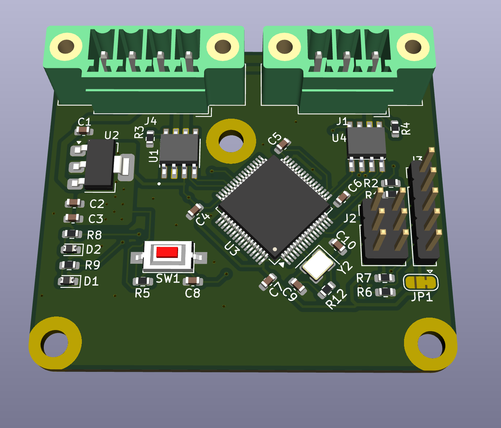

# Secure LIN-to-CAN Gateway with AES Encryption

This project implements a **custom PCB gateway** that bridges **Local Interconnect Network (LIN)** and **Controller Area Network (CAN)** communication buses. It integrates **AES-based cryptographic software** to ensure secure message transfer across networks, making it suitable for both embedded research and industrial-grade applications.

---

## Features

- **MCU Core:** STM32F107 microcontroller
- **CAN Transceiver:** MCP2551 for reliable CAN bus communication
- **LIN Transceiver:** TJA1020 for LIN bus interface
- **Crypto Layer:** AES software encryption for secure message payloads
- **Voltage Regulation:** On-board LM317 regulator provides stable 3.3V supply
- **Programming & Debugging:** SWD interface for firmware upload and debugging
- **User Interface:** Reset button, status LEDs, and configuration jumper
- **Compact PCB Design:** 2-layer PCB optimized for automotive and embedded systems

---

## Hardware Overview

### Major Components

- **U3 – STM32F107**: 32-bit ARM Cortex-M3 MCU
- **U1 – MCP2551**: High-speed CAN transceiver
- **U4 – TJA1020**: LIN transceiver for automotive communication
- **U2 – LM317**: Adjustable linear regulator, set to 3.3V output
- **Y2**: External crystal oscillator for precise MCU timing

### Connectors

- **J1 / J2**: LIN and CAN bus connections
- **J3**: SWD programming/debugging interface
- **JP1**: Boot configuration jumper

---

## Firmware

The firmware implements:

- LIN message reception, decryption, and forwarding to CAN
- CAN message reception, encryption, and forwarding to LIN
- AES-based payload encryption for secure communication
- Error handling and bus monitoring

---

## Applications

- **Automotive Systems:** Securely bridging LIN and CAN buses in vehicles
- **Industrial Automation:** Protecting data integrity across mixed communication buses
- **IoT Gateways:** Encrypted transport between legacy fieldbuses and modern networks
- **Research & Development:** Testing secure communication protocols in embedded systems

---

## Getting Started

1. **Assemble the PCB** with the provided KiCad files and BOM.
2. **Flash the firmware** via the SWD interface.
3. **Connect LIN and CAN networks** to the respective terminals.
4. **Test secure message transfer** with your chosen CAN/LIN monitoring tools.

---

## License

This project is licensed under the CERN Open Hardware Licence Version 2 - Strongly Reciprocal (CERN-OHL-S v2).
